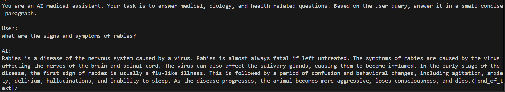

# AI Medical Assistant

AI-based medical assistant using fine-tuned Llama 3.2 3B language model with MedQuAD dataset.

## Features

- Fine-tuned Llama 3.2 3B model
- QLoRA with 4-bit quantization
- Generates responses up to 1024 tokens
- Trained on 16,407 medical Q&A pairs

## Performance

- BERTScore: 0.87
- ROUGE-L: 39

## Dataset

- **Source**: keivalya/MedQuad-MedicalQnADataset
- **Size**: 16,407 rows

## Setup

1. Install dependencies:
   ```bash
   pip install -r requirements.txt
   ```

2. Run the application:
   ```bash
   python main.py
   ```

## Usage




## Disclaimer

This AI assistant is for educational purposes only. Consult healthcare professionals for medical advice.